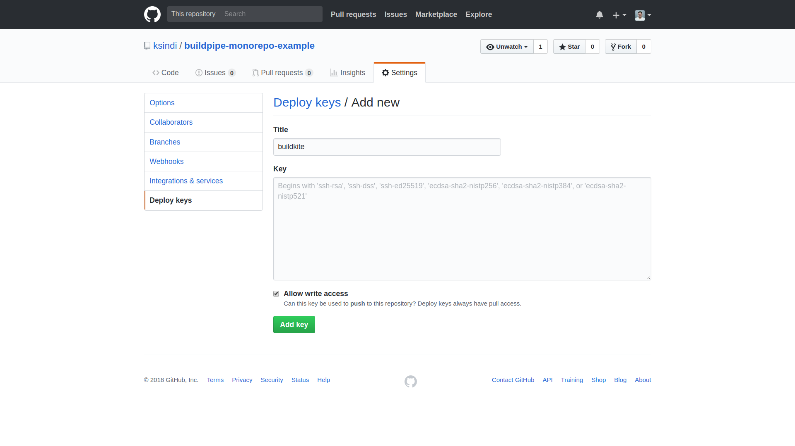
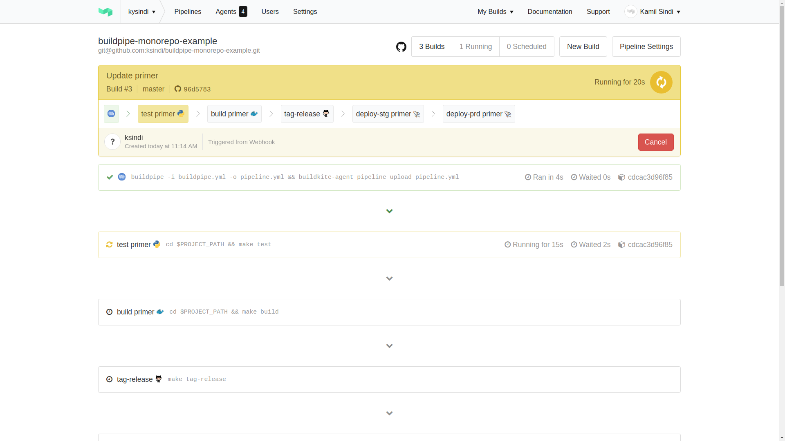
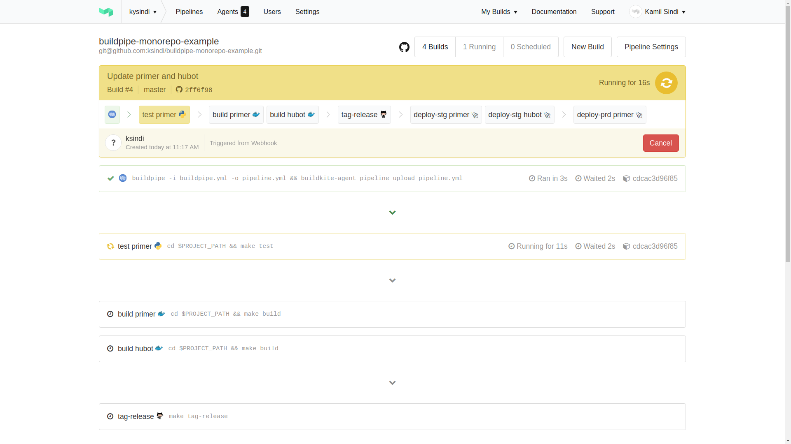

# Buildkite Monorepo Example

Example monorepo using buildkite plugin [buildpipe](https://github.com/jwplayer/buildpipe-buildkite-plugin/).

The monorepo config lives in [.buildkite/pipeline.yml](./.buildkite/pipeline.yml).
You can see there are 3 projects defined.

The config shows steps the projects share with their associated commands. The commands are standardized using `make` and Makefile inheritance.

## Getting started

1. Create the initial pipeline:
    ```yaml
    steps:
      - label: ":buildkite:"
        plugins:
          - jwplayer/buildpipe#v0.9.1:
              dynamic_pipeline: .buildkite/dynamic_pipeline.yml
    ```
1. Generate deploy key and change permissions
    ```bash
    # Start ssh agent in the background
    eval "$(ssh-agent -s)"

    # Generate ssh key
    make generate-deploy-ssh-key
    chmod 600 ~/.ssh/id_rsa_buildkite_git

    # Create agent socket
    ssh-agent -a ~/.ssh/ssh-agent.sock

    # Add ssh key
    ssh-add ~/.ssh/id_rsa_buildkite_git

    # Test key works
    # https://developer.github.com/v3/guides/using-ssh-agent-forwarding/
    ssh -T git@github.com
    ```
1. Add the public key `~/.ssh/id_rsa_buildkite_git.pub` to your Github repo under Settings > Deploy keys.
    
1. Run the buildkite agents locally:
    ```bash
    # Make sure to add to .bashrc
    export SSH_AUTH_SOCK=$HOME/.ssh/ssh-agent.sock
    export BUILDKITE_AGENT_TOKEN=<token>

    # Run agent in a docker container scaled to the number of cpus
    cd buildkite-agent/ && make local
    ```
You should see the number of agents at the top bar in Buildkite appear.

## Examples

The following examples shows how the pipeline creation is dynamic depending on which projects
were changed.

1. Updating primer project in master only triggers the primer pipeline to run
    
1. Updating both primer and hubot projects in master triggers both pipelines
    
