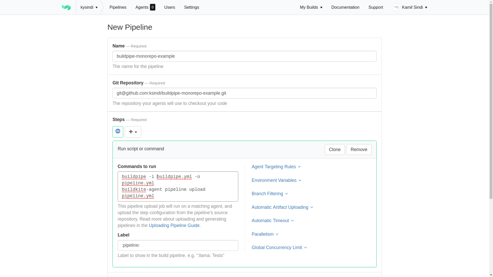

# Buildkite Monorepo Example

Example monorepo using third-party buildkite tool [buildpipe](https://github.com/ksindi/buildpipe/).

The monorepo config lives in [buildpipe.yml](./buildpipe.yml).
You can see there are 3 projects defined and deploy steps only happen during Eastern time business hours.

The config shows steps the projects share with their associated commands. The commands are standardized using `make` and Makefile inheritance.

## Getting started

1. Create a pipeline adding the following initial step
    ```bash
    buildpipe -i buildpipe.yml -o pipeline.yml
    buildkite-agent pipeline upload pipeline.yml
    ```
    
1. Generate deploy key and change permissions
    ```bash
    make generate-deploy-ssh-key
    chmod 600 ~/.ssh/id_rsa_buildkite_git
    ```
1. Add the public key `~/buildkite-secrets/id_rsa_buildkite_git.pub` to your Github repo under Settings > Deploy keys.
    
1. Run the buildkite agents locally:
    ```bash
    # Start ssh agent in the background
    eval "$(ssh-agent -s)"
    ssh-agent -a ~/.ssh/ssh-agent.sock
    ssh-add ~/.ssh/id_rsa_buildkite_git

    # Make sure to add to .bashrc
    export SSH_AUTH_SOCK=$HOME/.ssh/ssh-agent.sock
    export BUILDKITE_AGENT_TOKEN=<token>

    # Run agent in a docker container scaled to the number of cpus
    cd buildkite-agent/ && make local
    ```
You should see the number of agents at the top bar in buildkite appear

## Examples
The following examples shows how the pipeline creation is dynamic depending on which projects
were changed.

1. Updating primer project in master only triggers the primer pipeline to run
    
1. Updating both primer and hubot projects in master triggers both pipelines
    
